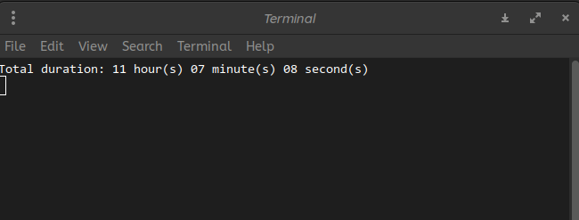

# Nemo-Durations
Nemo scripts to display selected audio and video file durations in Nemo right click menu

### Required python libraries
* tkinter
* ffmpeg-python

### Configuration steps

* Place the two files - AVDuration.py and AVDuration in your $HOME/.local/share/nemo/scripts/ directory

* Open Nemo. At the topbar, click on Edit -> Plugins and make sure that the script AVDuration is enabled

* Select all the desired audio / video files in nemo and right-click. You should now be able to see a new Scripts section. click on Scripts -> AVDuration and the total duration should be displayed in a window.

## Improved Duration Script AVD with C
The second script AVD runs much faster. AVDuration script runs slow when there are too much files at once.

There is no such issue with the AVD script

### Required Linux packages
* libavformat-dev
* libavcodec-dev
* libavutil-dev
* libavdevice-dev
* libao-dev

### Configuration steps
AVDurationC executable is directly provided. If it is not working for you, then you need to build the duration.c file to generate the executable first.

* gcc -o AVDurationC duration.c -lavformat -lavcodec -lavutil
* Place the two files - AVDurationC and AVD in your $HOME/.local/share/nemo/scripts/ directory
* Open Nemo. At the topbar, click on Edit -> Plugins and make sure that the script AVD is enabled
* Select all the desired audio / video files in nemo and right-click. You should now be able to see a new Scripts section. click on Scripts -> AVD and the total duration should be displayed in a terminal.

