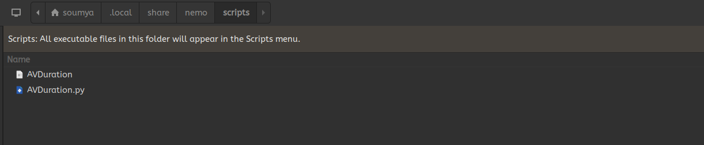
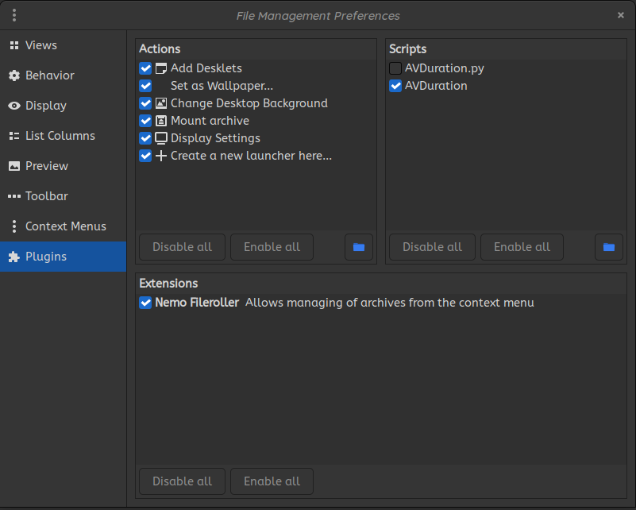
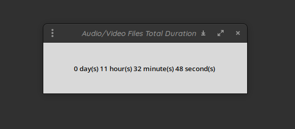

# Nemo-Durations
Nemo scripts to display selected audio and video file durations in Nemo right click menu

### Required python libraries
* tkinter
* ffmpeg-python

### Configuration steps

* Place the two files - AVDuration.py and AVDuration in your $HOME/.local/share/nemo/scripts/ directory

* Open Nemo. At the topbar, click on Edit -> Plugins and make sure that the script AVDuration is enabled

* Select all the desired audio / video files in nemo and right-click. You should now be able to see a new Scripts section. click on Scripts -> AVDuration and the total duration should be displayed in a window.

